## Setup Bedrock

Activate the Bedrock LLM model on AWS.

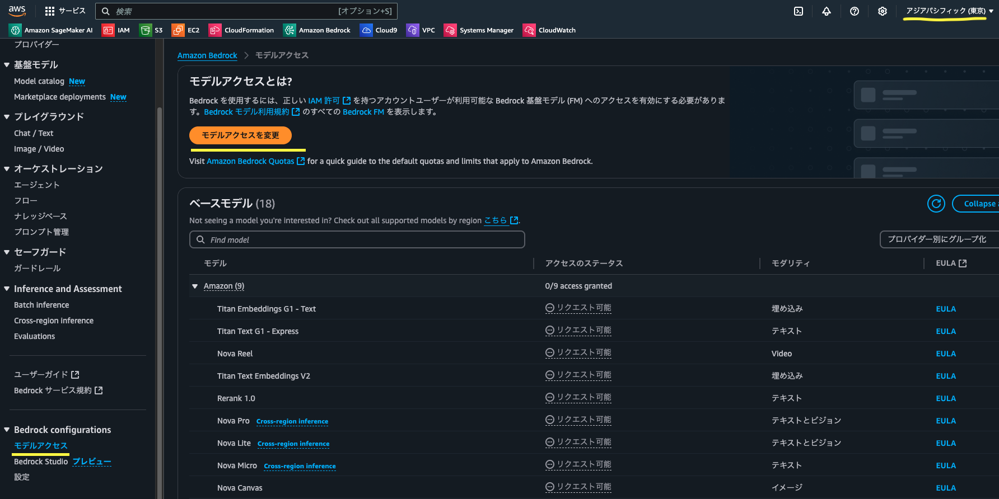

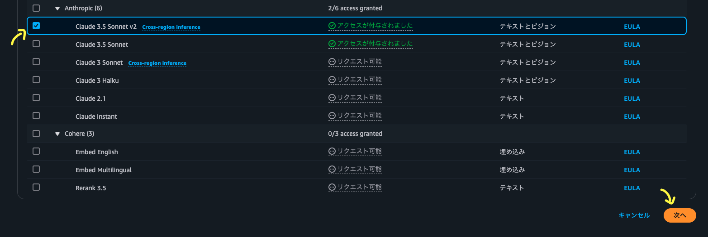

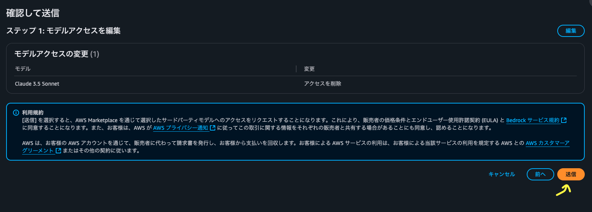


## Create a policy

Create a policy with the following permissions:

``` json
{
    "Version": "2012-10-17",
    "Statement": [
        {
            "Sid": "VisualEditor0",
            "Effect": "Allow",
            "Action": "bedrock:InvokeModelWithResponseStream",
            "Resource": [
                "arn:aws:bedrock:*:*:inference-profile/*",
                "arn:aws:bedrock:*::foundation-model/*"
            ]
        }
    ]
}
```

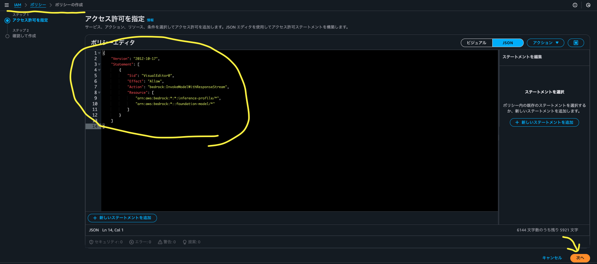

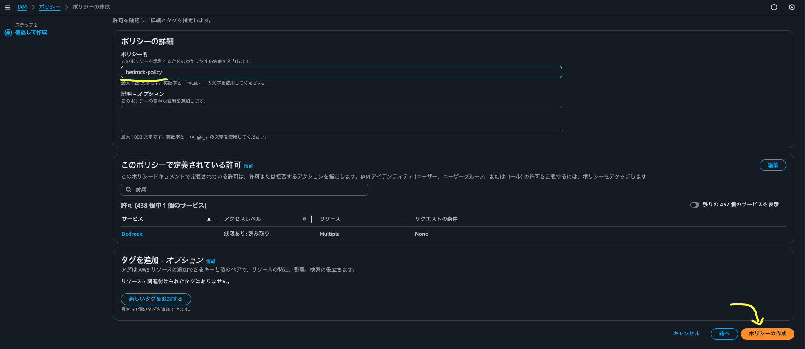

## Create a role and attach the policy

Create a role and attach the policy created in the previous step.

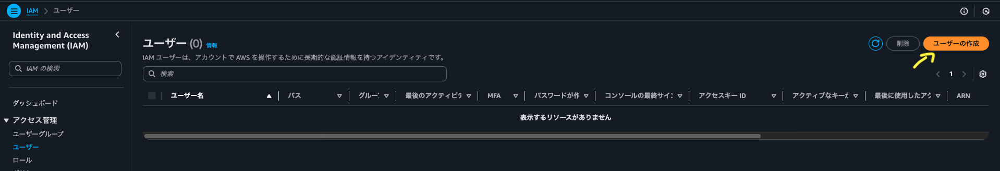

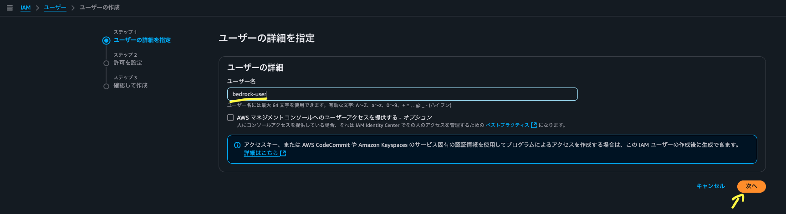

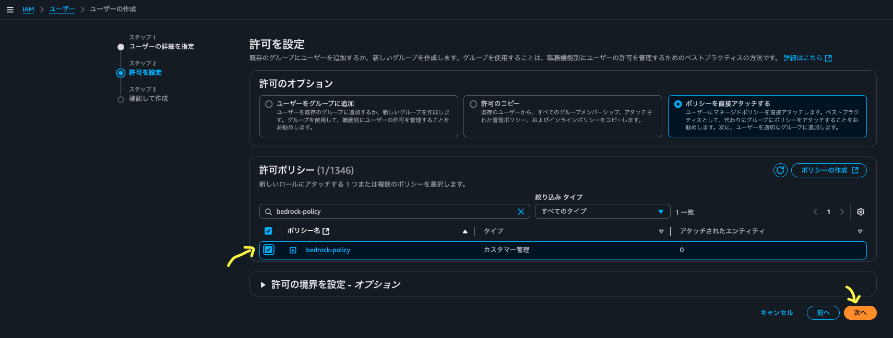

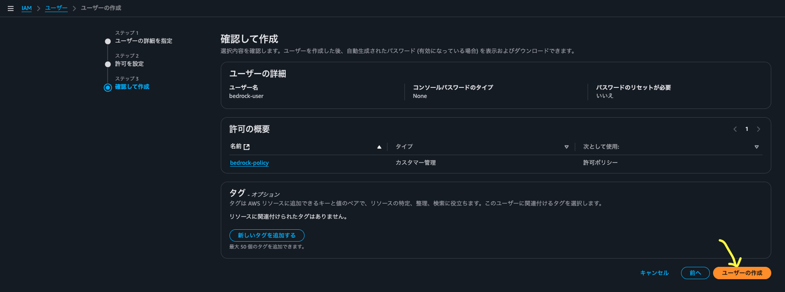

## Get the credentials

Get the credentials for the role created in the previous step.

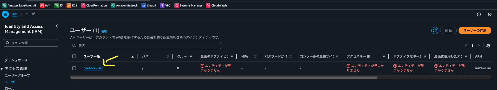

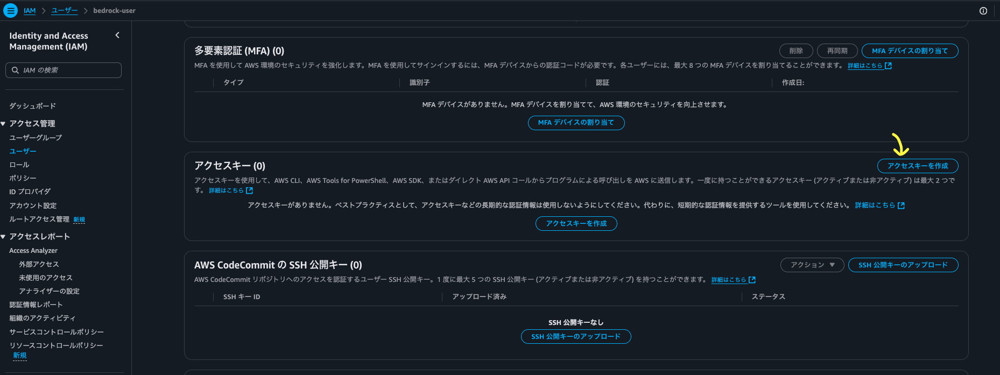


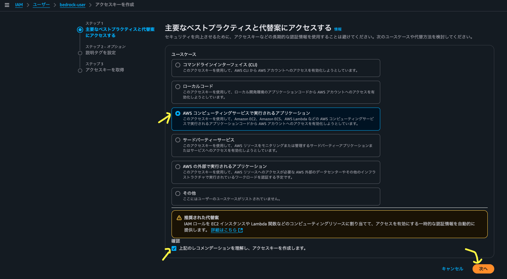

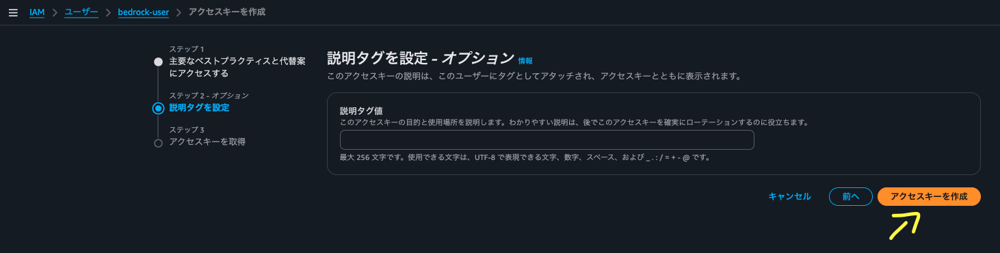


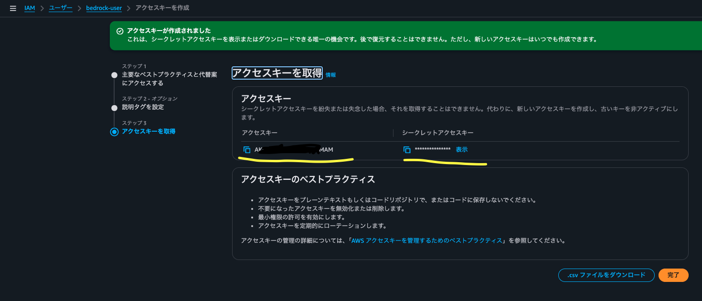

## Create a `.env` file

Create a `.env` file in the project root with your AWS credentials:

``` bash
AWS_ACCESS_KEY_ID=your_access_key_here
AWS_SECRET_ACCESS_KEY=your_secret_key_here
AWS_REGION=ap-northeast-1
BEDROCK_MODEL_ID=apac.anthropic.claude-3-5-sonnet-20241022-v2:0
```

